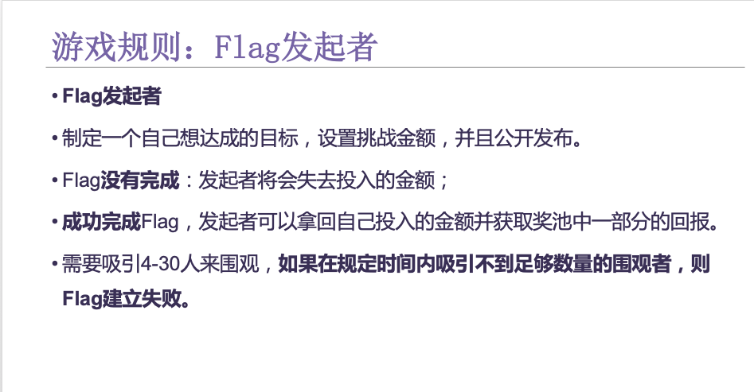
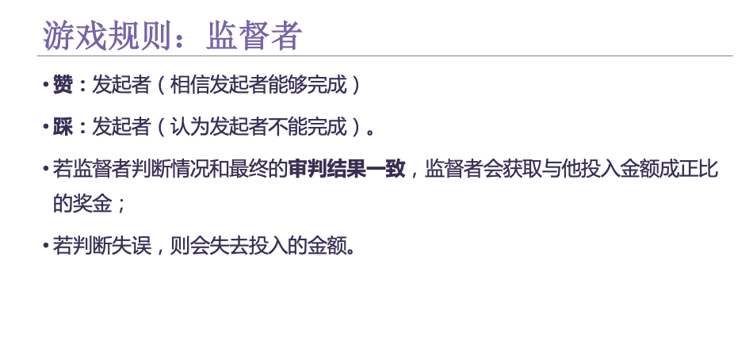
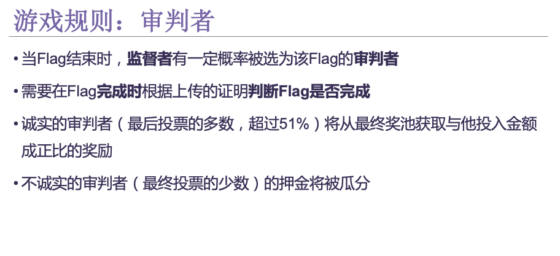

# Shanghai-Hackthon-BitFly

## 一、项目简介

我们的小游戏名为“立个Flag”，用户可以发起flag，其他用户可以加入围观，发起方和围观者加入都需要支付一定量的以太币，最后根据发起人的flag是否实现分配奖池奖金 。与预言家项目不同的是，我们引入了一套复杂的审判者委员会机制，根据最后委员会投票判定Flag是否完成，这样可参与预测的事件范围将比预言家更大，不仅仅局限于确定性非常强的事件。  

##二、详细规则

在这个Flag小游戏中，你可以选择成为Flag发起者，制定一个自己想达成的目标，并且公开发布。发布需要一定的金额，如果Flag完成失败，您将会失去投入的金额，金额将会自动进入奖池。如果您成功的完成了Flag，您将会收获一定比例在奖池中的金额。同时作为发起者，发起的Flag需要吸引4-30人来围观，如果在规定时间内吸引不到足够数量的围观者，则Flag建立失败。

 当然，您也可以选择投入一定金额成为他人Flag的围观者，当Flag正式开始时，您有一定概率被选为该Flag的审判者，被选为审判者的人的押注无效，诚实的审判者（最后投票的多数）将从最终奖池获取一定比例奖励，不诚实的审判者（最终投票的少数）的押金将被瓜分。

 作为监督者，您可以选择赞发起者（相信发起者能够完成），也可以选择踩发起者（认为发起者不能完成）。如果您的判断与发起者最后的完成情况一致，您将会获取一定比例奖池中的奖金；反之，若判断失误，则会失去投入的金额。

 作为审判者，您需要在Flag发起者结束Flag后的限定时间内判断Flag是否完成，如果您的判断与超过51%的审判者判断一致，则您将会获得一定比例在奖池中的奖金；反之，如果您的判断与超过51%的审判者不一致，您将会失去投入的金额，金额将会自动归入奖池被其他参与者瓜分。

 奖池的金额组成：所有判断失误的审判者投入的金额+所有判断失误的围观者投入的金额+若Flag未完成，发起者投入的金额。

 

 

 

# 技术细节

前端使用React.js, 链端环境是Nervos的测试链，Nervos链上合约的编写使用的也是Solidity，但是Nervos还没有类似remix的一键式布署方案，所以只能先在remix里面编写、测试合约，然后复制abi, bytecode, 再调用Nervos的API去布署到他们的测试链上

## 1.合约布署

src文件夹结构：

```
./
├── components	//页面底部导航栏
│   ├── BottomNav
│   ├── BottomNav2
│   ├── BottomNav3
│   └── Submit
├── containers	//页面组件
│   ├── Add
│   ├── Detail
│   ├── End
│   ├── Home
│   ├── Home_backup
│   ├── List
│   └── Show
├── contracts //合约相关文件夹
├── pics
└── public
    └── images
```

合约布署需要用到的文件：

```
.
├── config.js
├── contracts
│   ├── Contract.sol
│   ├── compiled.js
│   ├── contracts.test.js
│   ├── deploy.js
│   └── transaction.js
├── nervos.js
└── simpleStore.js
```

### 布署流程：

1.复制Contract.sol的内容到remix，完成编译、调试后复制abi、bytecode里的object到compiled.js

```js
const bytecode = "<复制bytecode中的object到此处>"
const abi = "<复制abi到此处>"
module.exports = {
    abi,
    bytecode
}
```

2.获取一个测试账户，直接用以太坊的账户就可以，把私钥填入config.js文件：

```js
const config = {
  // chain: "http://121.196.200.225:1337",
  chain: "https://node.cryptape.com",	// Nervos测试链的地址
  privateKey: "<钱包私钥>",
  contractAddress: "<合约布署完成后将地址填在此处，现在先留空>"
}
module.exports = config
```

​	nervos.js会根据你的钱包私钥创建一个账户：

```js
const {
  default: Nervos
} = require('@nervos/chain')

const config = require('./config')

const nervos = Nervos(config.chain) // config.chain indicates that the address of Appchain to interact
const account = nervos.appchain.accounts.privateKeyToAccount(config.privateKey) // create account by private key from config

nervos.appchain.accounts.wallet.add(account) // add account to nervos

module.exports = nervos

```

​	contracts/transaction.js定义了一个基础的交易对象:

```js
const nervos = require('../nervos')
const transaction = {
	from: nervos.appchain.accounts.wallet[0].address,
    privateKey: nervos.appchain.acccounts.wallet[0].privateKey,
	nonce: 999999,
	quota: 5000000,
	chainId: 1,
	version: 0,
	validUntilBlock: 999999,
	value: '0x0'
};

module.exports = transaction

```

### 3.布署

​	deploy.js:

```js
const nervos = require('../nervos')
const {
  abi,
  bytecode
} = require('./compiled.js')

const transaction = require('./transaction')
let _contractAddress = ''
// contract contract instance
const myContract = new nervos.appchain.Contract(abi)

nervos.appchain.getBlockNumber().then(current => {
    transaction.validUntilBlock = +current + 88 // update transaction.validUntilBlock
    // deploy contract
    return myContract.deploy({
      data: bytecode,
      arguments: [],
    }).send(transaction)
  }).then(txRes => {
    if (txRes.hash) {
      // get transaction receipt
      return nervos.listeners.listenToTransactionReceipt(txRes.hash)
    } else {
      throw new Error("No Transaction Hash Received")
    }
  })
  .then(res => {
    const {
      contractAddress,
      errorMessage,
    } = res
    if (errorMessage) throw new Error(errorMessage)
    console.log(`contractAddress is: ${contractAddress}`)
    _contractAddress = contractAddress
    return nervos.appchain.storeAbi(contractAddress, abi, transaction) // store abi on the chain
  }).then(res => {
    if (res.errorMessage) throw new Error(res.errorMessage)
    return nervos.appchain.getAbi(_contractAddress).then(console.log) // get abi from the chain
  }).catch(err => console.error(err))

```

​	直接运行node deploy.js来布署合约

​	布署成功后会返回合约地址，复制合约地址然后填入config.js：

```js
const config = {
  // chain: "http://121.196.200.225:1337",
  chain: "https://node.cryptape.com",
  privateKey:"",
  contractAddress:"0x2F78bb940C08E50a31481140d28F6f99E46a4326"
}
module.exports = config

```

​	这个时候就可以移除掉自己的私钥信息了，transaction.js中的from，to属性也都去掉：

```js
const nervos = require('../nervos')
const transaction = {
	//from: nervos.appchain.accounts.wallet[0].address,
    //privateKey: nervos.appchain.acccounts.wallet[0].privateKey,
	nonce: 999999,
	quota: 5000000,
	chainId: 1,
	version: 0,
	validUntilBlock: 999999,
	value: '0x0'
}
module.exports = transaction
```

​	合约布署流程结束

### 3.与合约交互

​	在simpleStore.js中构建合约实例：

```js
const nervos = require('./nervos')
const {
	abi
} = require('./contracts/compiled.js')
const {
	contractAddress
} = require('./config')

const transaction = require('./contracts/transaction')
const simpleStoreContract = new nervos.appchain.Contract(abi, contractAddress)
module.exports = {
	contractAddress,
	transaction,
	simpleStoreContract
}
```

​	然后就可以直接通过合约实例调用合约接口，如Add页面调用合约的addFlag接口添加一个flag记录：

```js
handleSubmit = e => {
    var flag = {
        title: this.state.title,
        description: this.state.description,
        proof: this.state.proof,
        deposit: +this.state.deposit,
        start: +this.state.start,
        end: +this.state.end
    } 
    const { time, title } = this.state
    nervos.appchain
        .getBlockNumber()
        .then(current => {
        const tx = {
            ...transaction,
            //from: window.neuron.getAccount(),
            from: nervos.appchain.defaultAccount,
            quota: 999999999,
            value: parseFloat(flag.deposit),
            validUntilBlock: +current + 88,
        }
        this.setState({
            submitText: submitTexts.submitting,
        })
        // 调用合约addFlag接口添加Flag
        return simpleStoreContract.methods.addFlag(flag.title, flag.description, flag.proof, flag.deposit, flag.end, flag.start).send(tx)
    }).then(res => {
        console.log(res)
        if (res.hash) {
            return nervos.listeners.listenToTransactionReceipt(res.hash)
        } else {
            throw new Error('No Transaction Hash Received')
        }
    }).then(receipt => {
        if (!receipt.errorMessage) {
            this.setState({ submitText: submitTexts.submitted })
        } else {
            throw new Error(receipt.errorMessage)
        }
    }).catch(err => {
        console.log(err);
        this.setState({ errorText: JSON.stringify(err) })
    })
}
```

## 4. 运行代码

合约按照上述流程布署好后，运行代码：

```js
npm install
npm start
OR:
yarn install
yarn start
```

然后浏览器访问http://127.0.0.1:3000查看效果